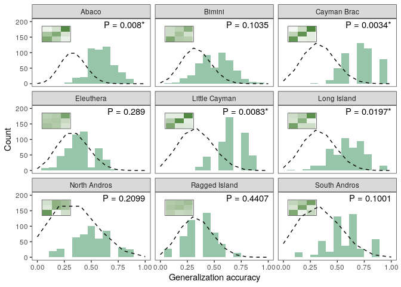

# nmgc: Nested Multivariate Group Comparisons in R

To install, use

```
devtools::install_github("rscherrer/nmgc")
```

This package provides tools to conduct group comparisons on multivariate datasets that typically have a nested design, that is, datasets where group comparisons must be repeated on multiple subsets of the data. This is typically the case, for example, for replicate samples on multiple islands across an archipelago. This package wraps around tools available in R to facilitate the analysis of such datasets. Most functions in the package take a data frame as argument, a set of `variables` to analyze, a `grouping` variable to perform the group comparison, and an optional `nesting` variable that indicates the different subsets to analyze separately. The package includes group comparison tests such as MANOVA, ANOVA or Kruskal-Wallis, but also machine learning classification procedures, with support for SVM and LDA. Data reduction via PCA is a feature of each of these functions. Additional tools are provided to test for multivariate and univariate normality, homogeneity of covariance matrices and the presence of outliers. A permutation test of spatial autocorrelation within subsets is also available. But let's dive in with a worked out example.


The example dataset is highly multidimensional, and consists of reflectance spectrometry measurements taken on multiple individual lizards of the species *Anolis sagrei* throughout islands in the West Indies, and we are interested in detecting differences in coloration between different habitats (our `grouping` variable) within each island (our `nesting` variable). The measurements consist of reflectance scores across wavelengths from 300 to 700nm:


```
##   island habitat    wl300    wl301    wl302
## 1  Abaco coastal 4.569845 4.561261 4.552587
## 2  Abaco coastal 4.014955 4.082736 4.149790
## 3  Abaco coastal 5.591848 5.563230 5.534733
```

Note that all functions can perform their analyses on non-nested datasets, if the `nesting` argument is unspecified. The output will be similar, albeit slightly different for some functions, but this is not the focus of this vignette.

# Machine learning classification analysis

We can use the `classify` function to train classifier machines to recognize patterns of differences between our groups in a multidimensional space. The function supports two types of classifiers: SVM and LDA.

## Support Vector Machines

We can train Support Vector Machines (SVM) to learn the differences in multivariate reflectance between lizards from different habitats, on each island separately, using:


```r
variables <- paste0("wl", 300:700)
res_ml <- classify(
  data, variables = variables, grouping = "habitat", nesting = "island",
  method = "SVM", k = 5, nrep = 1, seed = 24, digest = FALSE     
)
```

This function splits the dataset into subsets, one for each island, and performs a classification analysis with k-fold cross-validation. That is, each subset is split into `k` bins at random, and each bin in turn is taken as a testing set, while the rest consists of a training set that will be used to train a classifier machine. The type of classifier is defined by `method`, and currently supports Linear Discriminant Analysis (LDA) and SVM. A k-value of 5 means that each machine is tested against 20% of the data that it was not fitted on. The procedure is repeated `nrep` times, so in the end, `k` times `nrep` machines will be trained. Increasing `nrep` will take more time but will correct for stochasticity, especially when the subsets are small. A `seed` can be provided to make the result reproducible. In this algorithm, the training sets are downsampled to the number of observations of the least represented group in the training set, to avoid biasing the classification. You can specify a `minsize` argument specifying the minimum number of observations that each group must have in the training set. Use `verbose` and `pb` to turn on and off messages and progress bars (useful when the analyses takes a while). 

The `classify` function returns a list of confusion matrices, representing the outcome of the classification test performed on each machine, i.e. the number of observations from the testing set classified into each group (in rows), versus the group they actually came from (in columns). The list is nested within each level of the nesting variable (here islands), and then within replicates and cross-validation bins. To access the confusion matrix of the first bin within the first replicate on the first island, use:


```r
res_ml[[1]][[1]][[1]]
```

```
## $conf
##            
## predictions coastal coppice mangrove
##    coastal        2       2        1
##    coppice        5       2        0
##    mangrove       0       1        5
## 
## $imp
## NULL
## 
## $machine
## NULL
```
The result also features fields `imp` and `machine`. Those will be filled if arguments `importance` and `return_machine` are set to TRUE, respectively. `importance` specifies to also perform a one-dimensional sensitivity analysis on the data (as implemented in the `Importance` function from the `rminer` package). This procedure evaluates, for each machine, how the classification output changes with changes in the input variables, and returns a vector of relative importance scores (which sum up to one) across input variables. But caution, this procedure makes the whole analysis a lot longer. The argument `return_machine` will return the actual fitted machine, which can then be re-used in further classification.

If the argument `digest` is TRUE, the function returns, instead of a nested list of confusion matrices, machines and importance vectors, a list of summaries of the classification analysis.


```r
res_ml_digest <- classify(
  data, variables = variables, grouping = "habitat", nesting = "island",
  method = "SVM", k = 5, nrep = 100, seed = 24, digest = TRUE     
)
```
The first summary is `mean`, a data frame showing the mean classification accuracy (how many observations were correctly classified during the testing of the machines), and, if `test` is TRUE (the default), the number of observation in each subset, the proportion of each subset used in testing as well as the number of observations in the testing set, and a binomial test's P-value assessing the significance of the deviation from the observed mean classification accuracy to that expected if a machine was guessing at random, given the number of observations in the testing set. 


```r
res_ml_digest$mean
```

```
## # A tibble: 9 x 6
##   island         accu     n ptest ntest  pvalue
##   <chr>         <dbl> <int> <dbl> <dbl>   <dbl>
## 1 Abaco         0.598    86   0.2    17 0.00801
## 2 Bimini        0.513    67   0.2    13 0.104  
## 3 Cayman Brac   0.715    50   0.2    10 0.00340
## 4 Eleuthera     0.400    56   0.2    11 0.289  
## 5 Little Cayman 0.673    45   0.2     9 0.00828
## 6 Long Island   0.600    53   0.2    10 0.0197 
## 7 North Andros  0.515    28   0.2     5 0.210  
## 8 Ragged Island 0.372    50   0.2    10 0.441  
## 9 South Andros  0.583    31   0.2     6 0.100
```

The second summary, `avg`, is a list of average confusion matrices across machines (the average across replicates of the average across cross-validation bins), for each subset of the data. For example, here is the average confusion matrix on the first island:


```r
res_ml_digest$avg[[1]]
```

```
##            
## predictions coastal coppice mangrove
##    coastal    4.560   1.312    0.384
##    coppice    3.046   2.590    0.684
##    mangrove   0.594   0.898    3.132
```

The third summary, `accu`, contains the distribution of accuracy scores of all machines for each subset (ideal for plotting histograms of classification accuracy):


```r
res_ml_digest$accu %>% head
```

```
## # A tibble: 6 x 2
##   island  accu
##   <chr>  <dbl>
## 1 Abaco  0.5  
## 2 Abaco  0.588
## 3 Abaco  0.529
## 4 Abaco  0.647
## 5 Abaco  0.706
## 6 Abaco  0.667
```

The fourth summary, `confs`, is a nested list containing the confusion matrices of all machines, in a similar way to the `conf` element of the nested list returned by `classify` when `digest` is FALSE.

The fifth and last summary, `imp`, is a data frame recording the relative importance of each input variable measured across all machines, within each subset, and only if `importance` is TRUE. Again, beware that this setting is time-consuming.

## Linear Discriminant Analysis

The `classify` function supports SVM and LDA as its `method` argument. LDA analyses are typically faster than SVM, and the output is the same, so we do not show an example here.

## Plotting

We provide the `plot_classif` function to plot the output of `classify`. It is designed to work with classifications for which `digest` was set to TRUE, and contains lots of graphical parameters to tweak. The main layer on the plot is a histogram of classification accuracies. Other layers can be added. If `add_insets` is TRUE, average confusion matrices can be added as an inset plot. If `add_null` is TRUE, a dashed line is drawn showing the density of a corresponding binomial distribution, which is the expected distribution of classification accuracy under random guessing. If `add_pvalues` is TRUE, binomial test P-values are added to the plots. See `?plot_classif` for more information about the graphical parameters. If `type` is "confusion", then only average confusion matrices and no histograms are plotted.


```r
plot_classif(res_ml_digest, facets = "island")
```

```
## Warning: Removed 18 rows containing missing values (geom_bar).
```

<!-- -->

# Dimensionality reduction

Here is a good time to mention that most analysis functions in this package support dimensionality reduction using Principal Component Analysis (PCA) prior to perform the actual analysis. If the analysis is nested, e.g. within islands, then a PCA can be performed within each subset separately. For example, to perform a SVM-classification on the first four principal components of a PCA-reduced dataset, use:


```r
res_ml_pca <- classify(
  data, variables = paste0("PC", 1:4), grouping = "habitat", nesting = "island",
  method = "SVM", k = 5, nrep = 1, seed = 24, to_pcomp = paste0("wl", 300:700)
)
```

This will perform, within each island, a PCA on all 400 reflectance variables from 300 to 700nm, and retain the first four, which probably explain most of the variance. The `variables` analyzed are now the principal components, while the variables used to perform the PCA are provided in `to_pcomp`. Reducing the data with PCA may greatly reduce the time needed to perform the analysis. The results are returned as described in the previous sections.

In the backgroud, PCA-reduction is done using the function `npcomp` (which stands for "nested" principal component). This function performs PCA within each specified subset (or reduces to base R's `prcomp` if `nesting` is unspecified), and is used as follows:


```r
pca <- npcomp(
  data, variables = paste0("wl", 300:700), nesting = "island", 
  combine = TRUE, reduce = 1:4
)
```

If `combine` is FALSE, the function will return a list of multiple `prcomp` outputs, one for each subset. If `combine` is TRUE, it will return a summarized version of the multiple PCAs performed. In this case, the argument `reduce` indicates which principal components to retain from each subset before combining them all together.

The combined output is a list of multiple elements. The first element, `sdev`, is a data frame summarizing the proportion of the variance explained by each PC within each subset.


```r
pca$sdev
```

```
##          island      PC1       PC2      PC3      PC4
## 1         Abaco 15.46369 10.783280 5.677749 3.065505
## 2        Bimini 17.61209  7.306460 5.625033 1.772143
## 3   Cayman Brac 16.97114  7.341342 6.014440 4.066890
## 4     Eleuthera 17.35319  8.239919 4.880046 2.337868
## 5 Little Cayman 16.71492  8.026125 6.668240 2.958863
## 6   Long Island 17.77945  7.068883 5.557683 1.497839
## 7  North Andros 18.43650  5.610075 5.004799 1.789557
## 8 Ragged Island 17.41837  8.160352 4.566513 2.581146
## 9  South Andros 17.12160  8.655673 5.136694 2.337318
```

The second element, `rotation`, is a data frame consisting of the rotation matrices (as computed in `prcomp`) for each subset, stacked on top of each other.


```r
pca$rotation %>% head
```

```
##   island variable        PC1         PC2        PC3         PC4
## 1  Abaco    wl300 0.02299426 -0.06827056 0.09302942 -0.03730947
## 2  Abaco    wl301 0.02335639 -0.06819234 0.09303227 -0.03622363
## 3  Abaco    wl302 0.02371941 -0.06810913 0.09302540 -0.03513231
## 4  Abaco    wl303 0.02408320 -0.06802090 0.09300842 -0.03403644
## 5  Abaco    wl304 0.02444766 -0.06792764 0.09298093 -0.03293696
## 6  Abaco    wl305 0.02481270 -0.06782933 0.09294254 -0.03183485
```

The third element, `x`, is a data frame with the scores of each observation on each PC, for each subset. 


```r
pca$x %>% head
```

```
##   island        PC1       PC2       PC3        PC4
## 1  Abaco -29.939148 -1.577879 -8.322040  2.7105620
## 2  Abaco  14.934705 17.770042 -7.151000  3.0844927
## 3  Abaco -18.546992  7.323086 -5.702600  0.5333952
## 4  Abaco  -7.174420 12.960868  2.084155 -1.1887475
## 5  Abaco -14.161020  9.675904 -2.386465  0.8890259
## 6  Abaco  -9.171219  7.543711 -1.907055  0.8061455
```

# Analyses of Variance

## Univariate OLS and GLS-ANOVA

To perform more classical group comparison analyses, use the `nanova` function (which stands for "nested" ANOVA). Same as for `classify`, `nanova` takes a `to_pcomp` argument that allows it to work on PCA-reduced data. The `nanova` function can be used to perform multiple univariate ANOVAs, within each subset (if `nesting` is specified), along each of the specified `variables`. However, because the use of regular, Ordinary Least Squares (OLS) ANOVA is ill-advised when the variance is heterogeneous across groups (heteroskedasticity), this function uses a Generalized Least Squares (GLS) algorithm (function `gls` from the `nlme` package), which accounts for heterogeneity of variances across groups by estimating one residual variance per group. To avoid overfitting, the goodness-of-fit of each ANOVA is compared between its OLS and GLS version using AICc (from package `MuMIn`), and the results of the best fitting approach are returned (lowest AICc). The function is used as follows:


```r
res_anova <- nanova(
  data, variables = paste0("PC", 1:4), to_pcomp = paste0("wl", 300:700), 
  grouping = "habitat", nesting = "island", assumptions = TRUE, posthoc = TRUE
)
```

The results for each variable within each subset are returned in the form of a data frame showing the best-fitting model (OLS or GLS), where the P-values for the effect of the group-term are computed using a Likelihood Ratio Test on Maximum Likelihood-fitted models. Post-hoc multiple comparisons can be performed if the argument `posthoc` is TRUE, and one column is added for each contrast to be tested, featuring its respective P-value. Tukey's HSD test is used for post-hoc comparisons if the OLS-model was the best fit, however, if the assumption of homoskedasticity was violated and the GLS-model had the best fit, then Wilcoxon's test is used.


```r
res_anova$anova %>% head
```

```
##   island variable best_fit df_model     AICc     dAICc df_LRT    loglik
## 1  Abaco      PC1      OLS        4 710.4018 2.1577876      2 -356.9647
## 2  Abaco      PC2      OLS        4 620.0648 4.0234426      2 -310.1636
## 3  Abaco      PC3      OLS        4 517.7986 2.0062531      2 -257.1822
## 4  Abaco      PC4      OLS        4 440.5943 0.7807501      2 -217.1849
## 5 Bimini      PC1      OLS        4 561.3375 0.7721782      2 -283.0623
## 6 Bimini      PC2      OLS        4 448.0553 1.2868511      2 -223.7662
##       lratio       pvalue posthoc_test posthoc_p.coppice.coastal
## 1  0.1433509 9.308329e-01        Tukey               0.984790722
## 2 31.7398744 1.281663e-07        Tukey               0.868985265
## 3 27.3744990 1.136850e-06        Tukey               0.002482475
## 4  1.3583560 5.070336e-01        Tukey               0.548795514
## 5  7.3959761 2.477332e-02        Tukey               0.172604967
## 6  8.0915070 1.749652e-02        Tukey               0.304404544
##   posthoc_p.mangrove.coastal posthoc_p.mangrove.coppice
## 1               9.655618e-01               9.274196e-01
## 2               2.787590e-07               1.888324e-05
## 3               2.598535e-06               1.746319e-01
## 4               9.972540e-01               6.009108e-01
## 5               4.280168e-02               8.740972e-01
## 6               1.999662e-02               5.673585e-01
```

Note that if `assumptions` is TRUE, the function will also return a list of results of tests of assumptions of the (multivariate) analysis of variance, named `assum`. The first element of this list is `multinorm`, the results of multiple Henze-Zirkler's tests of multivariate normality within each group in each subset, if `univariate` is FALSE, or the results of multiple Shapiro-Wilk's tests on each variable within each group in each subset, if `univariate` is TRUE. For example, here: 


```r
res_anova$assum$multinorm %>% head
```

```
##   island  habitat        HZ       pvalue
## 1  Abaco  coastal 1.0825676 3.744642e-03
## 2  Abaco  coppice 1.0810702 1.963888e-03
## 3  Abaco mangrove 1.0720722 1.927927e-03
## 4 Bimini  coastal 1.2873856 4.560231e-05
## 5 Bimini  coppice 0.8635837 3.936611e-02
## 6 Bimini mangrove 1.1769895 1.416583e-04
```

The second element of `assum` is `cov`, a data frame with the results of Box's M-tets of homogeneity of covariance matrices across groups, performed within each subset.


```r
res_anova$assum$cov
```

```
##          island    chisq df       pvalue
## 1         Abaco 47.74481 20 4.618993e-04
## 2        Bimini 35.23021 20 1.891189e-02
## 3   Cayman Brac 37.08802 20 1.142084e-02
## 4     Eleuthera 61.61076 20 3.999912e-06
## 5 Little Cayman 33.48457 20 2.983026e-02
## 6   Long Island 53.01166 20 8.095229e-05
## 7  North Andros 33.30703 20 3.121278e-02
## 8 Ragged Island 26.81283 20 1.406124e-01
## 9  South Andros 46.31344 20 7.298907e-04
```

The last element in `assum` in `outliers`, a nested list of identified multivariate outliers within each group and each subset, found using the Mahalanobis distance. 

For more information on the assumption-testing functions, see `?test_multinorm`, `?test_covariance` and `?test_outliers` for each of these three outputs, respectively.

## MANOVA

The `nanova` function also implements the Multivariate Analysis of Variance (MANOVA). For this, set the `manova` argument to TRUE:


```r
res_manova <- nanova(
  data, paste0("PC", 1:4), to_pcomp = paste0("wl", 300:700), grouping = "habitat",
  nesting = "island", manova = TRUE, test = "Wilks", assumptions = FALSE
)
```

The `test` argument specifies the statistics used in the MANOVA, and can be either of those accepted in base R's `manova` function (the default is Pillai's trace). The results look like this:


```r
res_manova
```

```
##               df     Wilks   pseudoF num_df den_df       pvalue
## Abaco          2 0.4359095 10.292270      8    160 1.459530e-11
## Bimini         2 0.5930719  4.552324      8    122 7.178852e-05
## Cayman Brac    2 0.2722168 10.083135      8     88 7.062277e-10
## Eleuthera      2 0.6743717  2.721601      8    100 9.343631e-03
## Little Cayman  2 0.2173121 11.165231      8     78 2.208021e-10
## Long Island    2 0.6050416  3.355852      8     94 2.003965e-03
## North Andros   2 0.6756872  1.190982      8     44 3.263141e-01
## Ragged Island  2 0.7122028  2.034394      8     88 5.129574e-02
## South Andros   2 0.2688731  5.803311      8     50 3.070585e-05
```

## Kruskal-Wallis tests

You may want to repeat some analyses on specific subsets or variables that violate the assumptions of the aforementioned models, using nonparametric Kruskal-Wallis comparisons. You can do this with `nanova`, by setting `kw` to TRUE:


```r
res_kw <- nanova(
  data, paste0("PC", 1:4), to_pcomp = paste0("wl", 300:700), grouping = "habitat",
  nesting = "island", kw = TRUE, assumptions = FALSE
)
res_kw %>% head
```

```
##   island variable      chisq df       pvalue
## 1  Abaco      PC1  0.7351169  2 6.924229e-01
## 2  Abaco      PC2 23.1306623  2 9.489438e-06
## 3  Abaco      PC3 22.9626076  2 1.032127e-05
## 4  Abaco      PC4  1.2817997  2 5.268182e-01
## 5 Bimini      PC1  7.3787876  2 2.498714e-02
## 6 Bimini      PC2  6.9501937  2 3.095883e-02
```
For now, multiple post-hoc comparisons are not implemented for the Kruskal-Wallis tests, and are only done when univariate OLS/GLS ANOVAs are performed. I may change this in a further release, allowing e.g. to use Wilcoxon posthoc tests when performing Kruskal-Wallis tests.

# Spatial autocorrelation

Nested datasets spanning multiple islands, for example, often consist in a few sampling sites within each island. And often, those sampling sites are too few for checking for spatial autocorrelation using sites, and their multivariate means in the variables measured, as observation units in traditional Mantel's or Moran's I tests. One way to still test for spatial autocorrelation within islands, or subsets, when only a few sampling sites are present is to use individual observations as units and randmly shuffle them across sites many times, re-estimating the correlation between multivariate means of the sites and their geographical distances every time, to produce a null distribution. Such a permutation test is implemented in the function `nspcortest`, and can be used as follows:


```r
res_cortest <- nspcortest(
  data, variables = paste0("PC", 1:4), to_pcomp = paste0("wl", 300:700),
  nesting = "island", nperm = 10, seed = 24, lon = "longitude", lat = "latitude"
)
```

Here, the `lon` and `lat` argument specify the columns containing the longitude and latitude information, which must be present in the dataset for every individual. `nperm` must be high enough for the null distribution of spatial correlation coefficients to be meaningful (here it is too low, just for the sake of the example). The `see` can be reset to make the result reproducible. The results look like this:


```r
res_cortest$res
```

```
##          island         robs pvalue nsites
## 1         Abaco -0.001655843    0.3      7
## 2        Bimini  0.135519730    0.6      4
## 3   Cayman Brac  0.947590162    0.0      3
## 4     Eleuthera  0.910200612    0.0      5
## 5 Little Cayman  0.253654000    0.3      3
## 6   Long Island -0.307363157    0.7      4
## 7  North Andros  0.761789386    0.2      3
## 8 Ragged Island  0.478437564    0.1      4
## 9  South Andros -0.881836160    0.6      3
```

where `robs` is the measured Pearson's correlation coefficient between the Euclidean distances among the sites, within each subset, in multivariate variable-space, and the geodesic geographic distances among the sites at the surface of the Earth (computed using the `geosphere` package). The P-values indicate the proportion of the `nperm` permuted data had a spatial correlation coefficient higher than the one observed on the actual data. The number of sites for each subset is also returned.

In addition, the function returns a data frame showing the multivariate means and geographical coordinates of each site within each subset:


```r
res_cortest$sites %>% head
```

```
## # A tibble: 6 x 7
## # Groups:   island, longitude [6]
##   island longitude latitude   PC1     PC2    PC3    PC4
##   <fct>      <dbl>    <dbl> <dbl>   <dbl>  <dbl>  <dbl>
## 1 Abaco      -77.7     26.9 15.6    1.26  -0.325 -3.86 
## 2 Abaco      -77.6     26.9  2.39   5.74   0.451 -6.27 
## 3 Abaco      -77.6     26.9 -1.30   0.353  3.61  -2.00 
## 4 Abaco      -77.2     26.1  4.70  -1.00  -5.61  -0.409
## 5 Abaco      -77.0     26.3 -4.88 -13.2    5.10   0.568
## 6 Abaco      -77.0     26.3  1.42   3.39   0.703  1.48
```

We hope you enjoy using this package!
